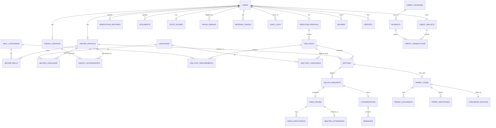

# HelperHaven — Data Model

## Overview

HelperHaven is a two-sided marketplace matching Singapore employers with migrant domestic workers (MDWs) from Indonesia, Myanmar, and the Philippines. The platform also acts as a licensed Employment Agency, handling MOM Work Permit applications post-match.

Four principal roles: **Employer**, **Helper**, **Agency**, **Admin**.

Core flow: profile (100-point budget across 5 fixed metrics) → match search → employer opens chat with 1 credit → helper replies within 48 h (else auto-refund) → mutual "Share contact" reveals PII → optional engagement of work-permit concierge → after helper arrives (`permit_cases.status ≥ CARD_ISSUED`) both sides can write contract-verified reviews → shared leave calendar for the 2-year contract → early termination flows through `termination_cases`, optionally routing the helper into the in-SG transfer pool.

## Entity Relationship Diagram

## Core Entities

### Identity & Roles

**users** — base account record, one row per real account regardless of role
- `id` (uuid, PK), `email` (unique, nullable for phone-first), `phone_e164` (unique), `password_hash`, `role` (EMPLOYER|HELPER|AGENCY|ADMIN), `status` (PENDING_VERIFICATION|ACTIVE|SUSPENDED|BANNED), `locale`, `created_at`, `last_login_at`
- Email OR phone required. Never both null.

**employer_profiles** — one-to-one with users where role=EMPLOYER
- `user_id` (FK/PK), `full_name`, `household_size`, `num_children`, `num_elderly`, `has_pets`, `housing_type` (HDB|CONDO|LANDED), `district`, `salary_offer_sgd_min`, `salary_offer_sgd_max`, `off_day_policy`, `preferences` (jsonb), `created_at`

**helper_profiles** — one-to-one with users where role=HELPER
- `user_id` (FK/PK), `display_first_name`, `nationality` (IDN|MMR|PHL), `date_of_birth`, `years_experience`, `religion`, `marital_status`, `education`, `bio`, `height_cm`, `weight_kg`, `dietary_restrictions` (jsonb), `willing_live_in`, `expected_salary_sgd`, `available_from`, `current_location`, `created_at`

**agency_profiles** — one-to-one with users where role=AGENCY
- `user_id` (FK/PK), `company_name`, `mom_ea_licence_number` (unique), `licence_expiry`, `address`, `uen`, `contact_person`, `created_at`

**agency_sponsorships** — helper ↔ agency relationship history
- `id` (uuid, PK), `helper_user_id` (FK), `agency_user_id` (FK), `status` (ACTIVE|REVOKED|EXPIRED), `started_at`, `ended_at`
- Unique partial index: one ACTIVE sponsorship per helper at a time

### Skills & Languages (reference + mapping)

**skill_categories** — seeded reference data
- `id` (smallint, PK), `code` (unique, e.g. COOKING, CLEANING, CHILDCARE, ELDERLY_CARE, PET_CARE, LAUNDRY, IRONING, DRIVING, TUTORING, INFANT_CARE, COOKING_HALAL, COOKING_CHINESE), `display_name`, `sort_order`, `is_active`

**languages** — seeded reference data
- `id` (smallint, PK), `iso_code` (unique, e.g. en, zh, ms, id, tl, my, yue, hi), `display_name`, `is_active`

**helper_skills** — helper's self-rating 0–100 per skill
- `helper_user_id` (FK), `skill_id` (FK), `rating` (0–100), composite PK

**helper_languages** — helper's proficiency 0–100 per language
- `helper_user_id` (FK), `language_id` (FK), `proficiency` (0–100), composite PK

**helper_experiences** — helper-written work history (V4, self-reported, **unvalidated**)
- `id` (uuid, PK), `helper_profile_id` (FK), `country_code` (ISO-2), `city`, `start_date`, `end_date` (null = current), `is_current`, `household_description` (text), `duties` (text[]), `languages_used` (text[]), `reason_for_leaving`, `description`, `created_at`, `updated_at`
- CHECK: `end_date >= start_date`; if `is_current = true` then `end_date IS NULL`
- Displayed on helper profile with a **"Self-reported"** notice banner. Do NOT conflate with `reviews` — reviews are the only contract-verified trust signal (gated by `permit_case_id` FK).

**job_posts** — an employer's active requirement (employer may have multiple)
- `id` (uuid, PK), `employer_user_id` (FK), `title`, `description`, `status` (DRAFT|ACTIVE|PAUSED|FILLED|CLOSED), `created_at`, `filled_at`

**job_post_requirements** — required skill weight + minimum
- `job_post_id` (FK), `skill_id` (FK), `required_rating` (0–100), `weight` (1–10), composite PK

**job_post_languages** — required language
- `job_post_id` (FK), `language_id` (FK), `required_proficiency` (0–100), composite PK

### Matching

**matches** — cached pair score between job post and helper
- `id` (uuid, PK), `job_post_id` (FK), `helper_user_id` (FK), `score` (numeric 5,2, 0–100), `factors` (jsonb: per-skill contribution), `computed_at`, `stale_at`
- Unique: (job_post_id, helper_user_id)

### Credits & Payments

**credit_wallets** — per-user credit balance
- `user_id` (FK/PK), `balance` (int, non-negative), `reserved` (int, non-negative), `updated_at`

**credit_packages** — reference price catalog
- `id` (smallint, PK), `code` (unique), `role` (EMPLOYER|HELPER), `credits`, `price_sgd_cents`, `is_active`

**payments** — Stripe payment intents, one per purchase attempt
- `id` (uuid, PK), `user_id` (FK), `package_id` (FK, nullable — null for concierge), `amount_sgd_cents`, `currency`, `provider` (STRIPE|PAYNOW), `provider_ref`, `status` (PENDING|SUCCEEDED|FAILED|REFUNDED), `kind` (CREDIT_PURCHASE|CONCIERGE_FEE), `created_at`, `settled_at`

**credit_transactions** — append-only ledger
- `id` (uuid, PK), `wallet_user_id` (FK), `delta` (int, signed), `reason` (PURCHASE|UNLOCK_RESERVE|UNLOCK_BURN|UNLOCK_RELEASE|ADMIN_ADJUST|REFUND), `reference_type`, `reference_id`, `balance_after` (int), `created_at`

### Unlock & Chat

**unlock_requests** — one credit spend opens a chat thread (V3: no helper-side credit)
- `id` (uuid, PK), `match_id` (FK), `initiator_user_id` (always the employer), `counterparty_user_id` (the helper), `initiator_credit_txn_id` (FK), `status` (PENDING|ACCEPTED|EXPIRED|COMPLETED), `created_at`, `expires_at`, `accepted_at`, `helper_first_reply_at`, `auto_refund_at` (= created_at + 48 h), `refunded_at`, `refund_reason` (AUTO_NO_REPLY | MANUAL_EMPLOYER | ADMIN)
- Partial index `idx_unlock_auto_refund_due` drives the scheduled refund sweep

**conversations** — the chat thread itself (1:1 with an accepted unlock)
- `id` (uuid, PK), `unlock_request_id` (FK, unique), `user_a_id`, `user_b_id`, `status` (OPEN|CLOSED), `created_at`, `last_message_at`, `employer_shared_contact_at`, `helper_shared_contact_at`, `pii_revealed_at` (set only when both have tapped Share contact), `expires_at`

**messages** — chat messages with PII-redacted display copy
- `id` (uuid, PK), `conversation_id` (FK), `sender_user_id`, `body` (raw, used for moderation/audit), `redacted_body` (PII scrubbed by app layer on INSERT; shown in UI until `pii_revealed_at` is set), `has_redactions` (bool), `flagged` (bool), `sent_at`, `read_at`

**message_reports** — per-message abuse reports (separate from user-level `reports`)
- `id`, `message_id` (FK), `reporter_user_id`, `reason` (report_reason enum), `description`, `status` (OPEN|REVIEWING|RESOLVED|DISMISSED), `handled_by_admin_user_id`, `created_at`, `resolved_at`

### Verification & Trust

**verification_records** — KYC provider results
- `id` (uuid, PK), `user_id` (FK), `provider` (SUMSUB|ONFIDO|IDANALYZER|INTERNAL), `document_type` (PASSPORT|NATIONAL_ID|SELFIE|LIVENESS), `status` (PENDING|PASSED|REVIEW|FAILED), `decision_at`, `raw_response` (jsonb, encrypted application-side)

**document_hashes** — sybil defence; one-passport-one-account rule
- `id` (uuid, PK), `hash_sha256` (bytea, unique), `hash_type` (PASSPORT|NATIONAL_ID), `user_id` (FK), `created_at`
- Unique constraint on hash_sha256 → duplicate detection at DB level

**documents** — uploaded files (encrypted at rest via KMS; stored in S3/MinIO)
- `id` (uuid, PK), `user_id` (FK), `type` (PASSPORT|NATIONAL_ID|SELFIE|WORK_REFERENCE|CERTIFICATE|CONSENT_FORM|IPA_LETTER|INSURANCE_POLICY|SECURITY_BOND|OTHER), `s3_key`, `mime_type`, `size_bytes`, `sha256`, `uploaded_at`, `status` (UPLOADED|VERIFIED|REJECTED)

**trust_scores** — rolling composite score per user
- `user_id` (FK/PK), `score` (numeric 5,2, 0–100), `factors` (jsonb: {kyc, agency, reviews, tenure, reports}), `updated_at`

**fraud_signals** — abuse flags awaiting or past review
- `id` (uuid, PK), `user_id` (FK, nullable — may be per-device), `device_fingerprint`, `ip_address`, `signal_type` (DUPLICATE_DEVICE|VPN|VELOCITY|LIVENESS_FAIL|DUP_PHOTO|BEHAVIOR), `severity` (LOW|MEDIUM|HIGH), `metadata` (jsonb), `resolved_at`, `resolution` (DISMISSED|SUSPENDED|BANNED), `created_at`

### Messaging (post-unlock only)

**conversations** — one per accepted unlock
- `id` (uuid, PK), `unlock_request_id` (FK, unique), `user_a_id`, `user_b_id`, `created_at`, `last_message_at`, `status` (OPEN|CLOSED)

**messages**
- `id` (uuid, PK), `conversation_id` (FK), `sender_user_id`, `body`, `sent_at`, `read_at`

### Work Permit Concierge

**permit_cases** — state machine for one MDW permit application
- `id` (uuid, PK), `employer_user_id` (FK), `helper_user_id` (FK), `match_id` (FK, nullable), `status` (DRAFT|DOCS_PENDING|SUBMITTED_MOM|INTERIM_APPROVED|BOND_INSURANCE|IPA_ISSUED|AWAITING_ARRIVAL|ARRIVED|SIP_DONE|MEDICAL_DONE|BIOMETRICS_DONE|CARD_ISSUED|CANCELLED|REJECTED), `mom_reference_number`, `security_bond_ref`, `insurance_policy_ref`, `assigned_admin_user_id` (FK), `created_at`, `updated_at`

**permit_documents** — docs attached to a case
- `id` (uuid, PK), `case_id` (FK), `document_id` (FK → documents), `role` (EMPLOYER_INCOME|HELPER_PASSPORT|HELPER_CONSENT|IPA_LETTER|BOND_RECEIPT|INSURANCE|MEDICAL_CERT|OTHER), `uploaded_at`

**permit_milestones** — due-date / completion tracking for MOM-mandated steps
- `id` (uuid, PK), `case_id` (FK), `milestone_type` (SECURITY_BOND|INSURANCE|SIP_REGISTRATION|HELPER_ARRIVAL|SIP_ATTENDANCE|MEDICAL_EXAM|BIOMETRICS|CARD_COLLECTION), `due_at`, `completed_at`, `notes`

**concierge_invoices** — service fees separate from matching credits
- `id` (uuid, PK), `case_id` (FK, unique), `payment_id` (FK), `amount_sgd_cents`, `status` (DRAFT|ISSUED|PAID|VOIDED|REFUNDED), `issued_at`, `paid_at`

### Reviews

**reviews** — post-meeting and post-placement feedback
- `id` (uuid, PK), `reviewer_user_id` (FK), `reviewee_user_id` (FK), `context` (MEETING|PLACEMENT), `reference_id` (uuid — room_id or case_id), `rating` (1–5), `body`, `visibility` (PUBLIC|PRIVATE|ADMIN_ONLY), `created_at`

### Admin & Audit

**reports** — user-filed abuse reports
- `id` (uuid, PK), `reporter_user_id` (FK), `subject_user_id` (FK), `reason` (SCAM|INAPPROPRIATE|FAKE_PROFILE|OFF_PLATFORM_PAYMENT|OTHER), `description`, `status` (OPEN|REVIEWING|RESOLVED|DISMISSED), `handled_by_admin_user_id`, `created_at`, `resolved_at`

**audit_logs** — append-only admin/sensitive action log
- `id` (uuid, PK), `actor_user_id` (FK, nullable), `action` (text), `target_type`, `target_id`, `metadata` (jsonb), `ip_address`, `user_agent`, `created_at`

**refresh_tokens** — for rotating JWT refresh
- `id` (uuid, PK), `user_id` (FK), `token_hash_sha256`, `device_fingerprint`, `expires_at`, `revoked_at`, `created_at`

## Key Design Notes

- **UUIDv7** everywhere for primary keys (sortable, index-friendly)
- **Append-only ledger** for credits → easy to audit, hard to corrupt
- **Enums as Postgres types** — strong typing at DB layer
- **JSONB** only for genuinely polymorphic data (raw KYC responses, factors, metadata)
- **Partial unique indexes** for "one active sponsorship per helper" style invariants
- **No cascading deletes** from user — use soft delete (`status=BANNED`) to preserve audit trail
- **PII encryption** — email, phone, full_name, passport_number encrypted application-side via Spring's Jasypt or a custom AttributeConverter backed by AWS KMS (local: static key)
- **Document storage** — S3 or MinIO, DB stores only key + metadata
- **Credit reservation pattern** — balance held in `credit_wallets.reserved`, final outcome writes +/- delta into `credit_transactions`; never mutate `balance` without a ledger row
- **48-hour auto-refund sweep** — a scheduled job scans `unlock_requests WHERE auto_refund_at < now() AND refunded_at IS NULL AND helper_first_reply_at IS NULL` and writes `UNLOCK_REFUND_AUTO` rows into `credit_transactions`. Helper's first message sets `helper_first_reply_at`, removing the row from the sweep set — the credit is then burned at thread close.
- **PII redaction in chat** — on every `messages` INSERT the app detects phone numbers, WeChat/Line/WhatsApp handles, email addresses, and SG postal codes via regex + a small heuristic, and writes the scrubbed version to `redacted_body`. UI shows `redacted_body` until `conversations.pii_revealed_at` is set (both sides tapped Share contact). Raw `body` is retained for moderation.
- **Contract-gated reviews** — enforced at three layers: `reviews.permit_case_id` FK, CHECK constraint `reviews_public_requires_contract` (PUBLIC visibility requires an attached case), and a service-layer guard that verifies `permit_cases.status >= CARD_ISSUED` before the row is created. Unique partial index prevents a reviewer from publishing multiple reviews for the same hiring.
- **Transfer pool** — `helper_profiles.available_for_transfer` + `transfer_available_from` let terminated-but-still-in-SG helpers reappear in matches with zero IPA-wait friction. Reviews attached to prior `permit_case_id` values follow the helper across employers since reviews reference helpers (not jobs).
